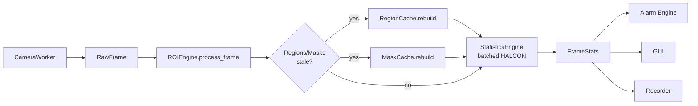
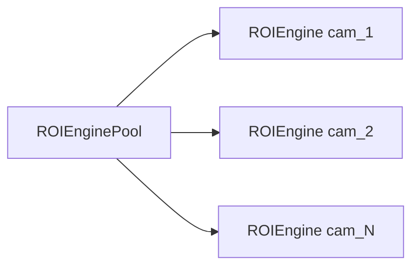
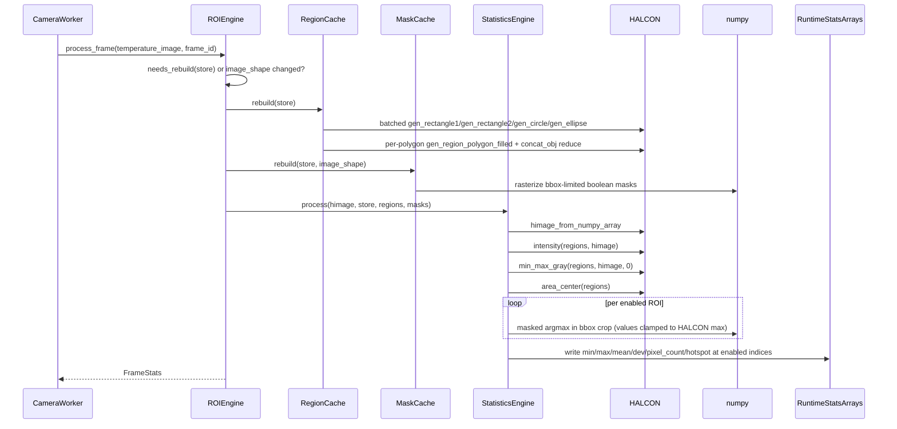
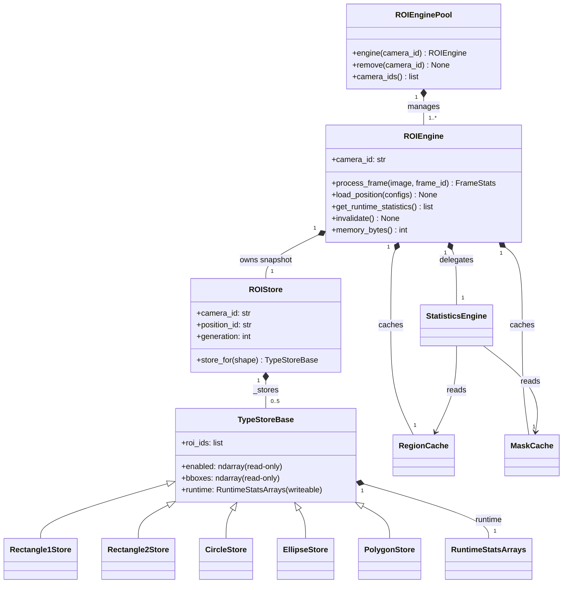

# ROI Processing Architecture (v2)

This document describes the batched ROI processing engine (`roi_engine/`), built as a parallel implementation of the legacy ROI pipeline (`roi/` + `processing/roi_processor.py`). It covers the architecture, the old-vs-new comparison, benchmark results, and a scalability analysis against the 9 FPS = 111 ms/frame budget.

**Last Updated:** 2026-08-04
**Benchmark environment:** Python 3.10.7, mvtec-halcon 24113.0.0, numpy 2.2.6, synthetic image 480x640, seed 42.

---

## 1. Context and Goals

### The legacy path and why it cannot scale

The legacy pipeline processes ROIs one at a time:

- `roi/runtime_manager.py` — `RuntimeROIManagerImpl.process_frame` (~line 268) iterates `get_active()` and calls `extract_statistics` per ROI.
- `roi/statistics.py` — `extract_statistics` runs the full HALCON stack per ROI: `reduce_domain`, `intensity`, `min_max_gray`, `area_center`, plus a `threshold` + `area_center` hotspot search.
- `roi/geometry_to_hregion.py` — one HALCON region constructor call per ROI (`geometry_to_hregion`).

Measured cost: approximately 0.58 ms per ROI (benchmark ballpark 0.27-0.63 ms/ROI). At 1600 ROIs this is roughly 930 ms/frame — about 8x over the 111 ms budget. The per-ROI loop does not meet the 9 FPS target at production ROI counts.

### Goals of the new engine

1. **Batch HALCON operators per geometry type** instead of per ROI, so one tuple operator call returns per-region values for an entire type.
2. **Immutable type-array store snapshots** (parallel numpy arrays), eliminating object-vs-array index drift.
3. **Cached HALCON regions + numpy masks** rebuilt lazily only when geometry or image shape changes.
4. **Multi-camera ready** — one engine per camera managed by a pool.
5. **Backward-compatible public API** — `get_runtime_statistics()` returns legacy `RuntimeROIStatistics` views; legacy JSON persistence round-trips.
6. **GUI untouched** — the engine is a parallel implementation; no legacy file is modified.

---

## 2. Architecture

The engine sits in the same architectural position as the legacy runtime manager: between the camera layer and the consumers (alarm engine, GUI, recorder). It never bypasses the processing stages defined in README.md.



The engine pipeline (documented in `roi_engine/engine.py`, never bypass stages):

```
ROIConfiguration (legacy model)
    -> ROIStore (immutable type-array snapshot)
    -> RegionCache / MaskCache (HALCON-derived regions)
    -> StatisticsEngine (batch HALCON statistics)
    -> FrameStats (per-frame results)
```

Multi-camera operation: `ROIEnginePool` registers one independent `ROIEngine` per camera id. Each engine owns its store snapshot, caches, and runtime arrays, and is used exclusively from that camera's acquisition thread.



---

## 3. Data Flow (per frame)

One `process_frame(temperature_image, frame_id)` call for one position snapshot:



Details of the hot path:

1. **Image conversion** — one `himage_from_numpy_array` per frame.
2. **Batch statistics per type** — for each non-empty type: `intensity` (mean, deviation), `min_max_gray` (min, max), `area_center` (pixel count). Tuple results are aligned with the type's enabled indices.
3. **Hotspot per ROI (numpy)** — for each enabled ROI: masked argmax within the bbox crop. Values are clamped to the HALCON `maximum` (any pixel hotter than the HALCON max is discarded), and the mask is dilated with 8-connectivity so the plateau carrying the exact HALCON maximum is always a candidate.
4. **Write runtime arrays** — results written into `RuntimeStatsArrays` at enabled indices; arrays are reused every frame (no reallocation in the hot path).
5. **FrameStats assembly** — one `TypeFrameStats` per non-empty type, plus frame id, timestamp, elapsed ms, total pixel count, and enabled ROI count.

---

## 4. Class Relationships



Key structural points:

- `ROIEngine` is the per-camera facade. It owns one immutable `ROIStore` snapshot, the `RegionCache` and `MaskCache`, and the `StatisticsEngine`.
- `ROIStore` is a frozen dataclass holding one `TypeStoreBase` per geometry shape (`Rectangle1Store`, `Rectangle2Store`, `CircleStore`, `EllipseStore`, `PolygonStore`) plus a `roi_id -> (shape, index)` lookup.
- Config arrays (`enabled`, `visible`, `alarm_*`, `bboxes`) are set read-only after build; only `RuntimeStatsArrays` stay writeable. The statistics engine overwrites them every frame.
- `ROIEnginePool` is the multi-camera registry: `engine(camera_id)` creates on first use, `remove` clears and drops.

---

## 5. Key Design Decisions (with WHY)

1. **Batch per type, not per ROI.**
   HALCON tuple operators return per-region values aligned with the input region tuple. This turns N per-ROI HALCON round-trips into 5 fixed batch calls (one per shape). Empirically ~2 ms per operator for 500 ROIs vs ~0.58 ms/ROI in the legacy loop — the core of the speedup.

2. **`reduce_domain` is never used with region tuples.**
   HALCON's `reduce_domain` on a region tuple silently uses only the first region. The engine instead passes the full image and region tuple directly to `intensity`/`min_max_gray`, which accept a region tuple and return per-region tuples.

3. **`clip_region=false` guard before region generation.**
   Regions are built before any image exists (at `load_position` time). HALCON's default `clip_region=true` clips regions to the last-read image and silently produces empty regions when nothing has been read. The guard (`roi_engine/region_cache.py`) must run before any generation; it is deferred and non-fatal, matching the legacy `geometry_to_hregion` guard pattern.

4. **Immutable store snapshot with generation counter.**
   Any configuration change builds a new `ROIStore` with a bumped generation (atomic reference swap). Caches rebuild only when the generation or the image shape changes. Because config arrays are frozen read-only, array-vs-object index drift is structurally impossible.

5. **Masks: bbox-limited bool arrays + geometric rasterization matched to HALCON.**
   Hotspot search runs in numpy, so each ROI needs a boolean mask over its clamped bounding box. Rasterization was calibrated against HALCON 24.11: circle = integer pixel-center test; ellipse = 2x2 supersampled pixel-center test (matches HALCON's `gen_ellipse` axis convention); rectangle2 = polygon fill of the four corners; polygon = 4x4 supersampled even-odd ray casting. `RECTANGLE1` has no mask — the bbox slice IS the region, so hotspot uses a direct crop. Masks are dilated with 8-connectivity so the true region pixels are always candidates and the hotspot plateau carries the exact HALCON maximum.

6. **HALCON authoritative for statistics; numpy ONLY for hotspot position.**
   minimum, maximum, mean, standard deviation, and pixel count come exclusively from HALCON batch operators. numpy computes only the hotspot argmax. Coordinate convention: `hotspot_row` is the image row, `hotspot_col` the image column; the display x=col / y=row mapping is applied by consumers, not the engine.

7. **Exception isolation.**
   An operator failure inside one type invalidates that type for the frame (`valid=False`) and processing continues with the remaining types; errors never propagate to the caller. The engine facade additionally wraps the whole frame and returns an empty `FrameStats` on failure — the industrial never-crash rule.

8. **Parallel implementation, legacy untouched.**
   The engine depends only on legacy *models* (`roi.types.ROIShape`, `roi.configuration.ROIConfiguration`, `roi.geometry`, `roi.acquisition_state`, `roi.alarm_settings`). The current public `RuntimeROIManager` API, JSON persistence files, and all legacy modules remain importable and unchanged.

9. **Multi-camera: one engine per camera via `ROIEnginePool`.**
   An engine is not thread-safe within itself; each camera owns one engine used from its acquisition thread. The pool keeps the registry and lifecycle (create / get / remove / clear) in one place.

Additional implementation notes:

- **Bounding boxes come from geometry math**, never HALCON `smallest_rectangle1`, which is ~30x slower per call in batch.
- **Polygon regions are the least batched part**: generated per polygon with `gen_region_polygon_filled` (the same operator the legacy path uses, so regions are pixel-identical), then combined with `functools.reduce(concat_obj, ...)`. A Python list of HObjects is not accepted by batch operators and `concat_obj` takes exactly two objects; the reduce chain preserves input order.

---

## 6. Old vs New Comparison

| Aspect | Legacy (`roi/` + `processing/roi_processor.py`) | Batched engine (`roi_engine/`) |
|---|---|---|
| Architecture | Per-ROI loop: `RuntimeROIManagerImpl.process_frame` iterates active ROIs | Per-type batch: 5 fixed operator groups over type stores |
| Data layout | Objects: `RuntimeROI` instances with per-ROI state and HALCON handles | Parallel numpy arrays: immutable config arrays + reused runtime arrays |
| Region generation | One HALCON call per ROI (`geometry_to_hregion`) | Batched `gen_rectangle1`/`gen_rectangle2`/`gen_circle`/`gen_ellipse` per type; polygons per-ROI + `concat_obj` reduce; cached tuple |
| Statistics | `extract_statistics` per ROI: `reduce_domain` + `intensity` + `min_max_gray` + `area_center` | Batched `intensity` / `min_max_gray` / `area_center` on region tuples |
| Hotspot | HALCON per ROI: `threshold` at max + `area_center` | numpy masked argmax in bbox crop, values clamped to HALCON max, 8-connected dilated mask |
| Caching | Region cache per ROI with dirty flags (rebuild on demand) | `RegionCache` (per-type HALCON region tuples) + `MaskCache` (bbox-limited bool masks), rebuilt on generation/image-shape change |
| Memory profile | One HALCON region + reduced image per ROI; no numpy masks | Store arrays (~9-237 KB) + region pixel counts (~17-23 KB) + masks (~14-21 KB); ~415-475 KB Python-side allocation per frame |
| API compatibility | `RuntimeROIManager` public API, JSON repository | `get_runtime_statistics()` returns legacy `RuntimeROIStatistics` views; JSON round-trip preserved |

---

## 7. Benchmark Results

Source: `docs/benchmarks/ROI_Benchmark_Report.md` and `ROI_Benchmark_raw_results.json`, generated 2026-08-04T12:54:00 by `tests/benchmark_roi_pipeline.py`. Mixed shapes (50% Rectangle1, 20% Circle, 10% Ellipse, 10% Rectangle2, 10% Polygon) on a deterministic non-overlapping 480x640 grid (seed 42). Warmup 5 frames (covers the one-off cache rebuild); measured frames 15 (legacy reduced to 3 from 1000 ROIs). Frame budget: 9 FPS = 111 ms.

### Legacy vs. Batched

| ROIs | legacy median (ms) | batched median (ms) | speedup | legacy frames |
|---|---|---|---|---|
| 50 | 31.59 | 8.32 | 3.8x | 15 |
| 100 | 44.46 | 13.45 | 3.3x | 15 |
| 250 | 82.33 | 22.88 | 3.6x | 15 |
| 500 | 146.32 | 32.58 | 4.5x | 15 |
| 1000 | 337.18 | 87.65 | 3.8x | 3 |
| 1600 | 428.29 | 96.71 | 4.4x | 3 |

All tested counts stay under the 111 ms budget on the median. Note the p95 at 1000 and 1600 ROIs (115.6 and 124.4 ms respectively) edges above budget on the worst observed frames under load; the report's median-based verdict is that no tested count exceeds budget.

### Batched engine results (with memory)

| ROIs | store (ms) | region rebuild (ms) | mask rebuild (ms) | rebuild total (ms) | frame min (ms) | frame median (ms) | frame p95 (ms) | proc. median (ms) | alloc per frame (B) | total memory (B) | 111 ms budget |
|---|---|---|---|---|---|---|---|---|---|---|---|
| 50 | 0.77 | 2.64 | 13.74 | 16.37 | 6.64 | 8.32 | 11.54 | 8.20 | 415,824 | 41,470 | OK |
| 100 | 1.04 | 2.28 | 22.84 | 25.12 | 10.35 | 13.45 | 17.68 | 13.38 | 415,279 | 58,328 | OK |
| 250 | 1.87 | 4.37 | 52.78 | 57.15 | 20.01 | 22.88 | 40.67 | 22.81 | 420,784 | 75,969 | OK |
| 500 | 2.84 | 6.43 | 78.32 | 84.75 | 31.15 | 32.58 | 34.56 | 32.51 | 430,733 | 105,299 | OK |
| 1000 | 6.66 | 21.62 | 185.91 | 207.53 | 73.97 | 87.65 | 115.61 | 87.55 | 450,576 | 182,070 | OK |
| 1600 | 9.42 | 29.02 | 280.86 | 309.87 | 94.67 | 96.71 | 124.40 | 96.64 | 475,466 | 269,105 | OK |

Memory notes:

- `total memory (B)` = store arrays + region pixel counts + mask bytes (raw JSON breakdown, e.g. at 1600 ROIs: store 236,800 B, regions 16,935 B, masks 15,370 B).
- `alloc per frame (B)` is the Python-side tracemalloc estimate (3-frame pass, peak / frames); HALCON C-side memory is invisible to tracemalloc.
- Wall timing runs WITHOUT tracemalloc; the report notes tracemalloc skews numpy-heavy paths by 3-10x.

### Caveat (important)

Measurements were taken under approximately 100% external CPU load (PyCharm/Chrome). Absolute batched times are about 2x above clean-machine probes, but the relative legacy-vs-batched speedup ratios and the scaling curve are robust to constant CPU contention and are representative.

---

## 8. Scalability Analysis

### Scaling curve

Per-frame latency grows **11.6x for a 32x ROI increase** (1600 vs 50 ROIs: 96.71 / 8.32 ms), i.e. sub-linear. Batch overhead amortizes as ROI count grows: the per-frame cost is dominated by the 5 fixed batch operator groups (intensity, min_max_gray, area_center per type) plus the `himage_from_numpy_array` conversion and the per-ROI numpy hotspot work. Store build (0.77 ms at 50 → 9.42 ms at 1600) and region rebuild (2.64 → 29.02 ms) grow slowly; the mask rebuild is the largest one-off component but is amortized because it only runs when geometry or image shape changes.

### Clean-machine estimate

The report caveat implies batched times are ~2x slower under load, so at clean-machine conditions:

- 1600 ROIs: 96.71 / 2 ≈ 48 ms → conservatively 50-60 ms.
- 1000 ROIs: 87.65 / 2 ≈ 44 ms.

At 1600 ROIs the engine would leave roughly 50-60 ms of the 111 ms budget for calibration, alarm evaluation, and GUI work — comfortable for the 9 FPS target.

### Headroom math for 8 cameras

Worst case 8 cameras x 1600 ROIs = 12,800 ROIs total. Each camera runs its own engine in its own acquisition thread, so the per-camera budget remains 111 ms; there is no serialized global ROI pass. The engine stays real-time capable within the tested range, with the caveat that single-machine HALCON thread contention across 8 parallel engines is not yet verified on real hardware (see Section 12).

### Where it could break

1. **Hotspot numpy per ROI is O(bbox pixels).** The masked argmax is a per-ROI numpy pass. Very large ROIs or very high ROI density on a large frame will grow this term; it is not yet vectorized across ROIs (see Section 11).
2. **Polygon per-ROI generation is the least batched part.** Polygon regions are generated per polygon in `RegionCache.rebuild` (one `gen_region_polygon_filled` per ROI plus a `concat_obj` reduce chain). Polygon-heavy positions pay the legacy-style per-ROI generation cost on rebuild (rebuilds are amortized, but the worst-case first frame after a geometry change is heavier).

---

## 9. Backward Compatibility

- `ROIEngine.get_runtime_statistics()` returns a list of legacy `RuntimeROIStatistics` views, one per enabled ROI, ordered per type in `ALL_SHAPES` order and aligned with each type store's enabled indices. `hotspot_x = hotspot_col`, `hotspot_y = hotspot_row`; `alarm_active=False` / `alarm_since=None` placeholders are preserved (alarm evaluation is a next step).
- JSON persistence round-trip is tested: `tests/test_roi_engine.py::test_backward_compat_json_load` loads a legacy `JSONROIRepository` store into an engine and verifies the statistics views.
- The legacy pipeline files (`roi/`, `processing/roi_processor.py`) remain untouched and importable. The engine depends only on legacy models, so a rollback requires no code changes.

---

## 10. Verification Status

- **38/38 roi_engine tests pass** across `tests/test_roi_store.py` (11), `tests/test_region_cache.py` (9), `tests/test_statistics_batch.py` (7), and `tests/test_roi_engine.py` (11). Ruff clean.
- **Full suite: 487 passed; 8 pre-existing failures** in legacy tests:
  - `test_processing_pipeline` alarm-active assertions.
  - `test_roi_phase2` HALCON-area assertions + `halcon.HRegion` API usage.
  - These failures also occur on the committed baseline (HALCON 24.11 rasterization differences) and are NOT caused by `roi_engine`.
- **Benchmark correctness gate:** at 50 ROIs, all 50/50 results match legacy `extract_statistics` within 1e-6 (NaN-safe; `validation_mismatches: 0` in the raw results).
- The benchmark harness retries spurious `KeyboardInterrupt` inside HALCON C calls (Windows parallel-operator abort) up to 3x; timing covers only the successful attempt.

---

## 11. Known Limitations and Next Steps

1. **`ROIEngine` is not thread-safe within itself** — one engine per camera acquisition thread; concurrent use of one engine from multiple threads is unsupported.
2. **Hotspot numpy path is not yet vectorized across ROIs** — the per-ROI masked argmax loop is the least batched hot-path part.
3. **Masks are rebuilt on image-shape change only** — no incremental per-ROI updates when a single ROI geometry changes without a new store.
4. **Next steps:** alarm evaluation integration (alarm engine consuming `FrameStats`/runtime arrays), GUI adoption (out of scope this phase), and a production rollout decision per the recommendation below.

---

## 12. Go / No-Go Recommendation

This is a balanced assessment; the decision is a rollout strategy question, not a correctness question.

### Arguments FOR switching to the engine

- **Measured speedup 3.3-4.5x** on the worst-case (fully loaded) machine, with the ratio representative of clean conditions.
- **Sub-linear scaling**: 11.6x time for 32x ROIs; batch overhead amortizes with ROI count.
- **1600 ROIs within the 111 ms budget even under load** (96.7 ms median); clean-machine estimate 50-60 ms leaves substantial headroom.
- **Bit-compatible statistics**: the 50/50 gate against legacy `extract_statistics` within 1e-6 removes the correctness risk of switching.
- **Backward-compatible public API**: `get_runtime_statistics()` returns legacy views; JSON persistence round-trips.
- **Immutable store prevents index drift**: read-only config arrays make object/array desynchronization structurally impossible.
- **GUI untouched**: no GUI file is modified by the engine; adoption can be incremental.

### Arguments AGAINST / risks

- **Engine is not yet wired into the live GUI path**: `roi_workspace -> runtime_manager` remains the production path; the engine has no production frame source yet.
- **No multi-camera stress test on real hardware**: 8 parallel engines on one machine, with HALCON thread contention, is unverified.
- **Single-machine HALCON thread contention** for 8 parallel engines is unverified.
- **The 8 pre-existing legacy test failures** should be fixed or quarantined before the suite is fully green, so regressions are not masked by known-failing tests.

### Recommendation

**PROCEED to integration as a pilot** — run one camera through `ROIEngine` in parallel with the legacy path and A/B the statistics and latency on real hardware — rather than a full cut-over. Do not replace the legacy path in the same release that introduces the GUI changes; keep the switch reversible until the multi-camera contention profile and live-frame validation are complete.
